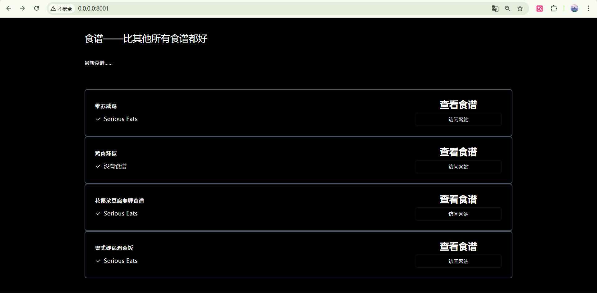

# Jinja2 Templates in FastAPI

## 什么是Jinja2？

Jinja2是Python的一个现代且设计友好的模板引擎，主要用于Web开发。它允许开发者在HTML模板中嵌入Python代码，实现动态内容生成。

## 在FastAPI中使用Jinja2Templates的详细步骤：

### 1. 导入必要模块
```python
from fastapi.templating import Jinja2Templates
from pathlib import Path
```

### 2. 配置模板目录
```python
# 获取当前文件所在目录的绝对路径
BASE_PATH = Path(__file__).resolve().parent
# 初始化Jinja2Templates对象，指定模板文件所在的目录
TEMPLATES = Jinja2Templates(directory=str(BASE_PATH / "templates"))
```

### 3. 创建HTML模板文件
在项目目录下创建templates文件夹，并在其中创建HTML模板文件（如index.html）。
在模板中可以使用Jinja2语法：
- `...`：循环语句
- `{{ variable }}`：变量输出
- `{# comment #}`：模板注释

### 4. 在路由中使用模板
```python
from fastapi import Request

@app.get("/")
def root(request: Request):
    # 使用TemplateResponse方法渲染模板
    # 第一个参数是模板文件名
    # 第二个参数是传递给模板的变量字典，其中"request"是必需的
    return TEMPLATES.TemplateResponse(
        "index.html",
        {"request": request, "recipes": RECIPES}
    )
```

### 5. 模板中访问数据
在HTML模板中可以通过传递的变量名访问数据：
```html
<!-- 遍历recipes列表 -->

    <!-- 输出recipe对象的label属性 -->
    <h2>{{recipe.label}}</h2>
    <!-- 输出recipe对象的source属性 -->
    <p>{{recipe.source}}</p>

```

## 总结

通过以上步骤，我们可以在FastAPI应用中成功集成Jinja2模板引擎，实现动态HTML页面的渲染。这种方式使得Web应用能够根据后端数据动态生成前端内容，提供了更好的用户体验。

